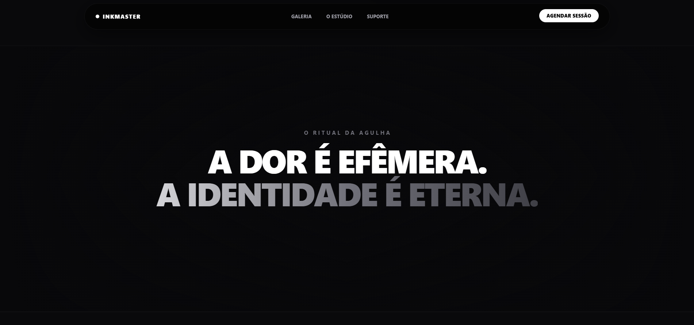

# ⁠⁠ InkMaster Studio

O **InkMaster Studio** é uma plataforma institucional moderna desenvolvida para estúdios privados de tatuagem conceitual de alto padrão que prezam pela excelência e simetria. O projeto combina um design minimalista, com paleta escura, detalhes em branco translúcido e cinza industrial, com uma experiência de usuário fluida e animações de alta fidelidade.

Este repositório contém a interface da página principal (Landing Page), incluindo componentes dinâmicos, transições de carregamento cinematográficas, formulário multifásico e um sistema de design responsivo.

<div align="center">
  
</div>

<br />

<div align="center">
  <h3>
    "Onde a arte encontra a anatomia. Precisão cirúrgica na pele."
  </h3>
  
[](https://inkmaster-studio.vercel.app/)
</div>

---

### ✨ Destaques de UI/UX

* **Carrossel 3D Interativo (Deck Stack):** Uma galeria de portfólio imersiva onde os cartões de obras passadas reagem a interações de arrastar (`drag`) e cliques via Framer Motion, exibindo dados técnicos de agulhas e sessões.
* **Formulário de Briefing Premium:** Sistema estagiado (`Step Form`) com seletor de estilo 100% customizado, eliminando os menus nativos feios do sistema operacional e coletando ideias de forma cirúrgica.
* **Scroll Margin Otimizado:** Pontos de ancoragem inteligentes (`scroll-mt-36`) calibrados milimetricamente para compensar a altura da Navbar flutuante e preservar o respiro escuro e centralizado do site.
* **Design de Luxo Minimalista:** Paleta de cores inspirada em estúdios privados de grife, usando sombras profundas, *glassmorphism* responsivo na Navbar e tipografia brutalista de grande escala.

---

## 🛠️ Tecnologias Utilizadas

     

---

## 🚀 Como Iniciar o Projeto

### Pré-requisitos

Antes de começar, você precisará ter o [Node.js](https://nodejs.org/) instalado em sua máquina.

### Instalação e Execução

1.  **Clone este repositório:**
    ```bash
    git clone [https://github.com/seu-usuario/inkmaster-studio.git](https://github.com/seu-usuario/inkmaster-studio.git)
    ```

2.  **Acesse a pasta do projeto:**
    ```bash
    cd inkmaster-studio
    ```

3.  **Instale as dependências:**
    ```bash
    npm install
    # ou
    yarn install
    ```

4.  **Inicie o servidor de desenvolvimento:**
    ```bash
    npm run dev
    # ou
    yarn dev
    ```

5.  Acesse `http://localhost:3000` no seu navegador para ver o resultado.

---

| Desenvolvido por DevLab © 2026
